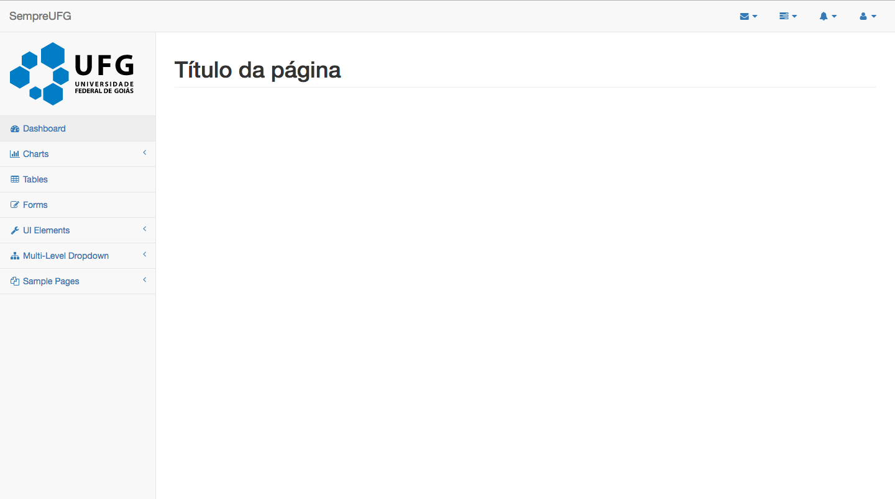
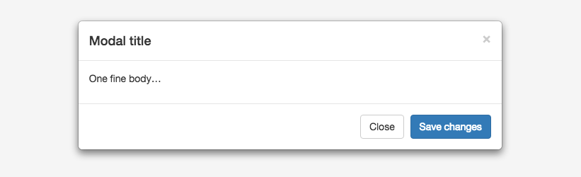
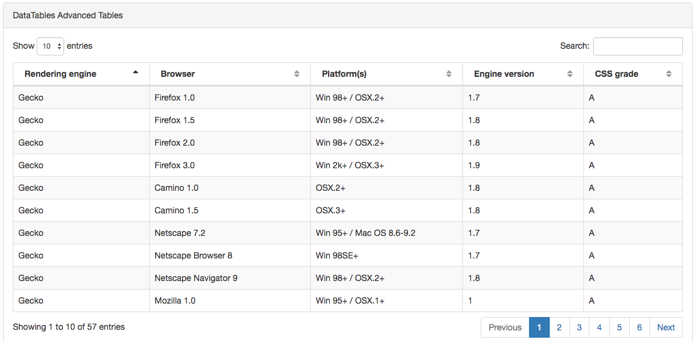

# Características de Usabilidade do Software SempreUFG

## Introdução
Esse documento servirá de referência para a interface do software SempreUFG que utilizará como template principal o SB Admin 2, utilizando o framework Boostrap.

## Template
O template SB Admin 2 pode ser encontrado por meio da URL: https://startbootstrap.com/template-overviews/sb-admin-2/. Todos seus componentes utilizam bootstrap.

## Estrutura
 As páginas do software SempreUFG deverá seguir a estrutura da imagem abaixo:

### Podemos observar a seguinte estrutura:

* Menu lateral esquerdo do tipo sidebar
  * Todos os itens do menu e itens de sub menu devem possuir um ícone seguido de texto
  * Alinhados a esquerda
  * Barra de navegação no topo da página
* Todos os itens da barra de navegação deve ser do tipo dropdown e posuirem icones.
* Os item deve ser alinhados a direita, ou seja no final da barra.
* Título da página no canto superior após o sidebar e navbar
Linha de separação entre o título da página e o restante do conteúdo.
* Todo o conteúdo da página deverá ser exibido no centro

## Mensagens
Todas as mensagens de alerta e confirmação deverão utilizar um popup do tipo modal conforme a imagem a baixo:

## Formulário

Os componentes de formulário serão padronizados conforme o template SB Admin 2 define. Segue URL para acesso a todos os componentes de formulário:

https://blackrockdigital.github.io/startbootstrap-sb-admin-2/pages/forms.html.

## Botões

Todos os botões serão do tipo "Default Buttons" coforme exemplificado na URL https://blackrockdigital.github.io/startbootstrap-sb-admin-2/pages/buttons.html

Os botões deverão seguir o seguinte padrão de cores:
Primary - Botões de envios de formulário e confirmação de uma determinada ação de forma positiva. Ex: Salva, Executar.
Warning - Botões de ações vinculadas a algum alerta, onde o resultado seja algo com alguma notificação Ex: Pendências, Alertas não críticos.
Danger: Botões de ações críticas como: Excluir e Cancelar

## Ícones
Os íncones das páginas deverão ser retirados da seguinte URL:
https://blackrockdigital.github.io/startbootstrap-sb-admin-2/pages/icons.html

## Tabelas

Todas as tabelas deverão seguir o padrão "Basic Table" conforme a URL:
https://blackrockdigital.github.io/startbootstrap-sb-admin-2/pages/tables.html
As tabelas com quantidade de linhas superiores a 30 deverão ser paginadas conforme a imagem abaixo:

