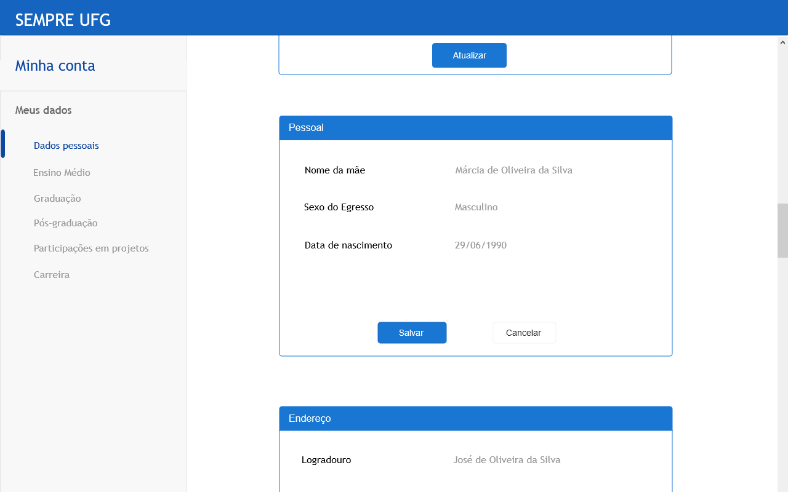
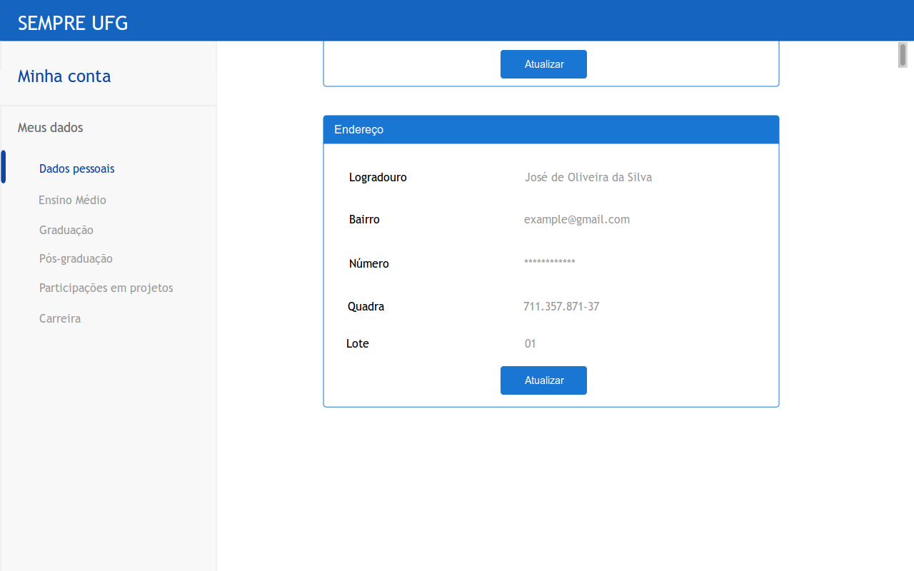
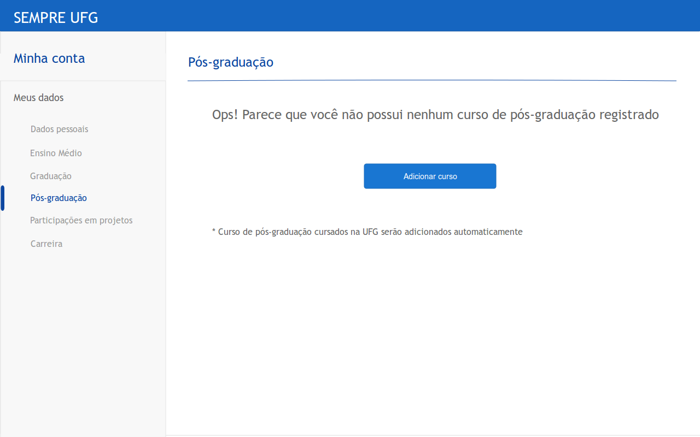
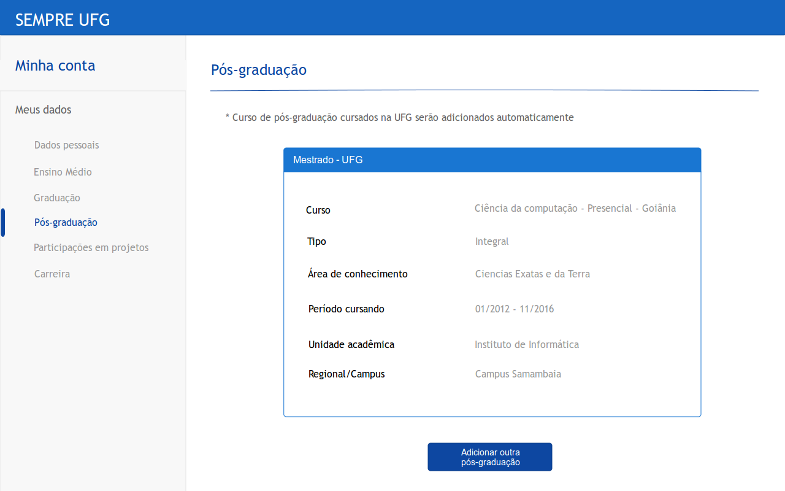
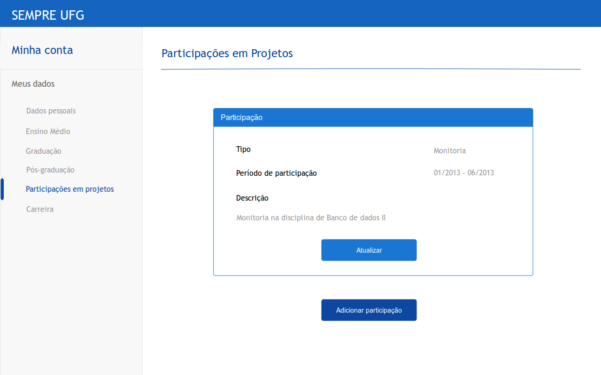
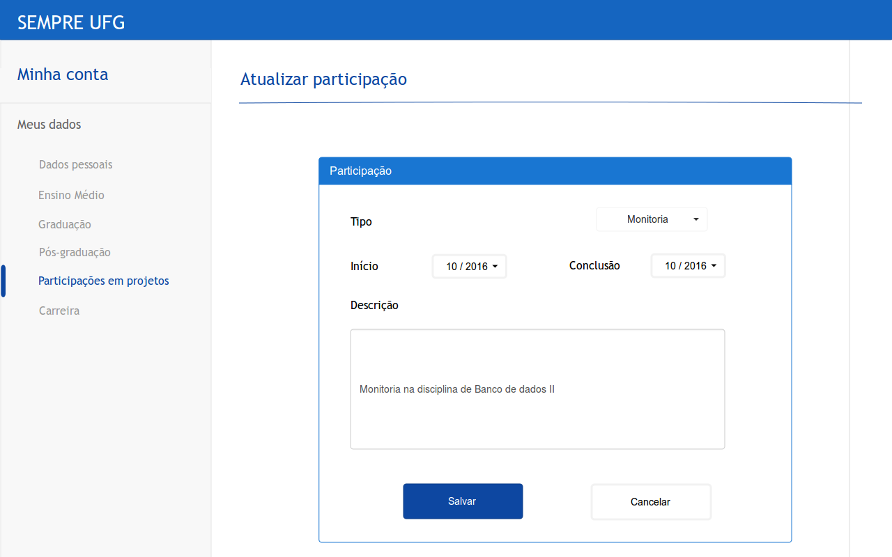
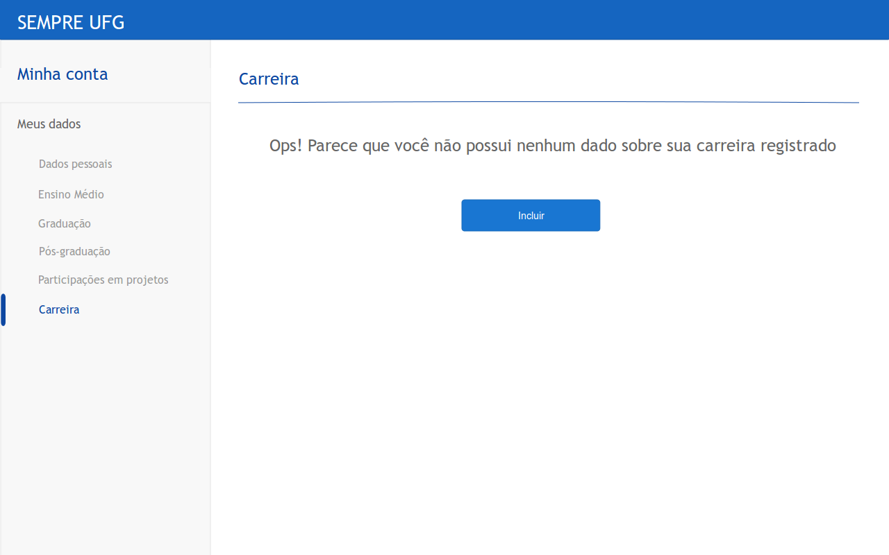
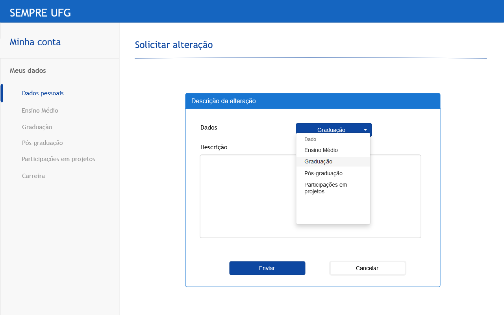

Documento de Especificação de Interface
=====================================================

## 1. RF-AtualEgres

### Pré-requisitos
O usuário deve fazer login e clicar na opção "Minha Conta".
Na imagem abaixo, o usuário tem acesso as suas informações de acordo com as opções do menu esquerdo.
Em qualquer sessão, **caso o usuário queira atualizar algo dado, basta clicar no botão "Atualizar"**      

### 1.1 Dados pessoais

Ao entrar na sessão "Dados pessoais" o usuário verá seus dados conforme a(s) tela(s) abaixo:  

#### Dados pessoais - identificação

#### Dados pessoais - pessoal

#### Dados pessoais - endereço residencial

#### Atualizar identificação

#### Atualizar endereço residencial

### 1.2 Ensino Médio

Ao entrar na sessão "Ensino Médio" o usuário verá seus dados conforme a(s) tela(s) abaixo:

Caso o usuário clique em "Solicitar alteração", será levado a esta [tela](#16-solicitar-altera%C3%A7%C3%A3o)

### 1.3 Graduação

Ao entrar na sessão "Graduação" o usuário verá seus dados conforme a(s) tela(s) abaixo:

O usuário não pode alterar ou incluir dados de graduações realizadas na UFG.

#### Adicionar ou atualizar graduação

Ao clicar em **"Adicionar outra graduação"** o usuário poderá adicionar uma graduação realizada em outra IES.

Após adicionar uma graduação de outra IES o usuário pode posteriormente **atualizar** seus dados por meio de um botão "Atualizar". A tela será a mesma, porém os campos salvos no sistema já aparecem preenchidos.

O dropdown do campo **"Nível"** possui as seguintes opções:

- Bacharelado
- Licenciatura

O dropdown do campo **"Tipo de instituição"** possui as seguintes opções:

- Pública
- Privada
- Autônoma

Caso o usuário queira **atualizar** algum dado de uma graduação realizada na UFG, deverá clicar em "Solicitar Alteração". Ele será levado a esta [tela](#16-solicitar-altera%C3%A7%C3%A3o)

### 1.4 Pós-graduação

Ao entrar na sessão "Pós-graduação" o usuário verá seus dados conforme a(s) tela(s) abaixo:

#### Usuário que não fez nenhuma pós-graduação
Como um egresso pode ainda não ter feito uma pós-graduação, neste caso ele irá se deparar com esta tela:  

#### Usuário que fez alguma pós-graduação

#### Adicionar ou atualizar Pós-graduação

O processo de atualizar ou adicionar uma pós-graduação é o mesmo explicado anteriormente para graduação, porém com algumas mudanças nos campos.

O dropdown do campo **"Nível"** possui as seguintes opções:

- Mestrado
- Doutorado
- Pós- Doutorado
- Especialização

O dropdown do campo **"Tipo de instituição"** possui as seguintes opções:

- Pública
- Privada
- Autônoma

Obs.: Cursos de pós-graduação na UFG são adicionados automáticamente, e não podem ter seus dados alterados

Caso o usuário queira **atualizar** algum dado de uma pós-graduação realizada na UFG, deverá clicar em "Solicitar Alteração". Ele será levado a esta [tela](#16-solicitar-altera%C3%A7%C3%A3o)

### 1.4 Participações em projetos
Ao acessar a opção "Partipações em projetos" o usuário acessará a seguinte tela:

#### Adicionar participação

### 1.5 Carreira
Ao acessar a opção "Carreira" o usuário acessará a seguinte tela:

#### Carreira ainda não preenchida

### 1.6 Solicitar alteração

Tela acessada quando o usuário clica no botão "Solicitar alteração", presente em campos que não podem ser alterados diretamente pelo usuário:

- graduações e pós-graduações realizadas na UFG
- dados de Ensino médio
- participações em projetos realizadas na UFG

Nesta tela o usuário pode informar que algum dos campos acima (capturado automaticamente pelo sistema) está errado.

