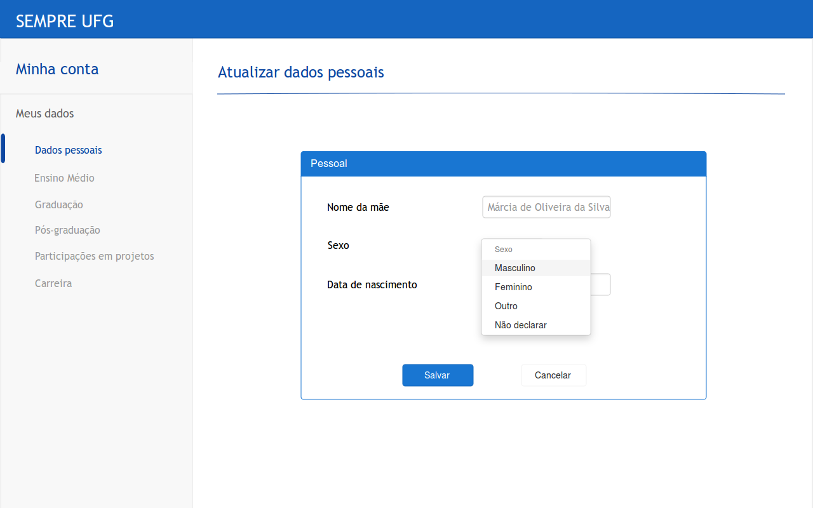

Documento de Especificação de Interface
=====================================================

## 1. RF-AtualEgres

### Pré-requisitos
O usuário deve fazer login e clicar na opção "Minha Conta".
Na imagem abaixo, o usuário tem acesso as suas informações de acordo com as opções do menu esquerdo.
Em qualquer sessão, **caso o usuário queira atualizar algo dado, basta clicar no botão "Atualizar"**      

### 1.1 Dados pessoais

Ao entrar na sessão "Dados pessoais" o usuário verá seus dados conforme a(s) tela(s) abaixo:  

#### Atualizar identificação

#### Atualizar endereço residencial

### 1.2 Ensino Médio

Ao entrar na sessão "Ensino Médio" o usuário verá seus dados conforme a(s) tela(s) abaixo:

#### Atualizar ensino médio

### 1.3 Graduação

Ao entrar na sessão "Graduação" o usuário verá seus dados conforme a(s) tela(s) abaixo:

O usuário não pode alterar ou incluir dados de graduações realizadas na UFG.

#### Adicionar graduação

Ao clicar em "Adicionar outra graduação" o usuário poderá adicionar uma graduação realizada em outra IES

#### Atualizar graduação

### 1.4 Pós-graduação

Ao entrar na sessão "Pós-graduação" o usuário verá seus dados conforme a(s) tela(s) abaixo:

O usuário não pode alterar ou incluir dados de pós-graduações realizadas na UFG.

#### Adicionar Pós-graduação

Ao clicar em "Adicionar outra Pós-graduação" o usuário poderá adicionar uma graduação realizada em outra IES

#### Atualizar Pós-graduação

