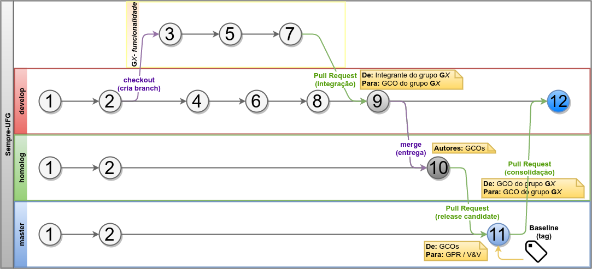

Plano de Gerência de Configuração
=================================

<small>Sumário</small>
======================

<!-- MDTOC maxdepth:2 firsth1:0 numbering:0 flatten:0 bullets:1 updateOnSave:1 -->

- [1. Introdução](#1-introdução)   
   - [1.1. Definições, Acrônimos e Abreviações](#11-definições-acrônimos-e-abreviações)   
   - [1.2. Referências](#12-referências)   
- [2. Organização, Responsabilidades, e Interfaces](#2-organização-responsabilidades-e-interfaces)   
   - [2.1. Responsabilidades dos GCOs](#21-responsabilidades-dos-gcos)   
   - [2.2. Responsabilidades da equipe de desenvolvimento em relação à GCO](#22-responsabilidades-da-equipe-de-desenvolvimento-em-relação-à-gco)   
- [3. A Gerência de Configuração](#3-a-gerência-de-configuração)   
   - [3.1. Artefatos da Gerência de Configuração](#31-artefatos-da-gerência-de-configuração)   
   - [3.2. Ferramentas e Tecnologias](#32-ferramentas-e-tecnologias)   
   - [3.3. Branches](#33-branches)   
   - [3.4. Estrutura do Repositório](#34-estrutura-do-repositório)   
   - [3.5. Identificação da Configuração](#35-identificação-da-configuração)   
   - [3.6. Commits](#36-commits)   
   - [3.7. Controle de mudanças](#37-controle-de-mudanças)   
   - [3.8. Baselines](#38-baselines)   

<!-- /MDTOC -->

## 1. Introdução
Este **Plano de Gerência de Configuração** apresenta todas as tarefas do
Gerenciamento de Configuração e Mudanças neste projeto. Nesse documento detalha-se toda a infraestrutura
utilizada neste projeto e como contribuir no mesmo.

### 1.1. Definições, Acrônimos e Abreviações

| Termo | Significado |
|------:|-------------|
| [**Baseline/Tag**](https://en.wikipedia.org/wiki/Baseline_%28configuration_management%29) | **Linha de referência** / "etiqueta" marcando ponto no desenvolvimento de software em que seus artefatos estão supostamente estáveis. |
| [**Branch**](https://en.wikipedia.org/wiki/Branching_%28version_control%29) | **Ramificação** / contexto de trabalho paralelo no desenvolvimento de software. |
| [**CamelCase**](https://pt.wikipedia.org/wiki/CamelCase) | forma de representação **escrita** de palavras compostas ou frases iniciadas por maiúsculas e unidas sem espaços. |
| [**CI**](https://en.wikipedia.org/wiki/Continuous_integration) | **Integração Contínua** (do inglês *Continuous Integration*), prática de fundir e verificar funcionamento de partes de software, várias vezes ao dia. |
| [**Commit**](https://en.wikipedia.org/wiki/Commit_%28version_control%29) | **Revisão**, de (todo ou parte de) um código-fonte num VCS. |
| [**GCO / GCS**](https://pt.wikipedia.org/wiki/Ger%C3%AAncia_de_configura%C3%A7%C3%A3o_de_software) | **Gerência de Configuração de Software**, área da Engenharia de Software que fornece apoio para o desenvolvimento de software. |
| [**IDE**](https://pt.wikipedia.org/wiki/Ambiente_de_desenvolvimento_integrado) | **Ambiente de Desenvolvimento Integrado** (do inglês *Integrated Development Environment*), software que reúne ferramentas para auxiliar e agilizar o desenvolvimento de software. |
| [**Issue**](https://en.wikipedia.org/wiki/Project_management_software) | **Incidente** / *card* / atividade ou pacote de trabalho dentro de um Sistema de Gerenciamento de Projetos. |
| [**Markdown**](https://en.wikipedia.org/wiki/Markdown) | Linguagem de Marcação Leve ([LML](https://en.wikipedia.org/wiki/Lightweight_markup_language)) para **documentos**. |
| [**Merge**](https://pt.wikipedia.org/wiki/Fus%C3%A3o_%28controle_de_vers%C3%A3o%29) | Operação em VCS que funde / **mescla** várias revisões em uma só. |
| [**Milestone**](https://en.wikipedia.org/wiki/Milestone_%28project_management%29) | **Marco do projeto**, reúne *Issues* / *PR*s para futura entrega de um software (ou parte dele) para um cliente. |
| [**PR**](https://en.wikipedia.org/wiki/Distributed_version_control#Pull_requests) | *Pull Request*, **solicitação de mudança** que é feita para administradores de um repositório decidirem se uma contribuição pode fazer parte do código-fonte do mesmo. |
| [**Push**](https://en.wikipedia.org/wiki/Version_control#Common_vocabulary) | Comando em alguns VCS para **enviar mudanças** (*commits*) para um repositório remoto. |
| [**VCS**](https://pt.wikipedia.org/wiki/Sistema_de_controle_de_vers%C3%B5es) | **Sistema de Controle de Versões** (do inglês *Version Control System*), software usado para fazer Gerência de Configuração. |

### 1.2. Referências

<h6 id="cite-ref-1"/>
###### 1. SANTOS, Gustavo Moraes dos et al. Template de Plano de Gerenciamento de Configuração. Disponível em: <http://github.com/gabrielaimeeg/DroidMetronome/wiki/TEMPLATE-Plano-de-Gerenciamento-de-Configuração>. Acesso em: 28 mar. 2015.

<h6 id="cite-ref-2"/>
###### 2. OLIVEIRA, J. L. Diretrizes para Membros da Equipe. Disponível em: <https://github.com/ES-INF-UFG-2016-2/Sempre-UFG/blob/develop/docs/wiki/extras/documentos-do-professor-juliano/diretrizes-para-membros-da-equipe.pdf>. Acesso em: 2 out. 2016.

<h6 id="cite-ref-3"/>
###### 3. OLIVEIRA, J. L. Requisitos de Software - SempreUFG. Disponível em: <https://github.com/ES-INF-UFG-2016-2/Sempre-UFG/blob/develop/docs/wiki/extras/documentos-do-professor-juliano/requisitos-de-software-para-sempre-ufg-2016.pdf>. Acesso em: 2 out. 2016.

<h6 id="cite-ref-4"/>
###### 4. WERNER, Tom Preston. Semantic versioning 2.0.0. Disponível em: <http://semver.org>. Acesso em: 28 mar. 2015.

## 2. Organização, Responsabilidades, e Interfaces
A gerência de configuração faz um papel fundamental para que o
desenvolvimento não seja prejudicado por informações inconsistentes.
Dessa forma, o gerente de configuração é responsável por controlar todas
as mudanças e disponibilizar a todos os envolvidos as versões e os itens
de configuração corretos e íntegros (artefatos de software) para que
inconsistências não atrapalhem a evolução do desenvolvimento (auditoria
das configurações) e permita uma melhor comunicação entre os membros da
equipe.

#### Gerentes de Configuração (GCOs)

A lista dos Gerentes de Configuração (GCOs) encontra-se nesta página:

[**@ES-INF-UFG-2016-2/GCOs**](https://github.com/orgs/ES-INF-UFG-2016-2/teams/GCOs)

### 2.1. Responsabilidades dos GCOs

* Manter padronizada a estrutura de diretórios do repositório (organização ― seções [3.4](#34-estrutura-do-repositório) e [3.5](#35-identificação-da-configuração));
* Supervisionar as *Issues* (pacotes de trabalho ― seção [3.7](#37-controle-de-mudanças));
* Supervisionar o fluxo de criação, andamento e exclusão das branches pelos integrantes dos grupos (seções [3.3](#33-branches) e [3.7](#37-controle-de-mudanças));
* Aprovar solicitações de mudanças (Pull Requests) sem "commits quebrados" – commits com não conformidades à GCO / código-fonte com erros de compilação / nos testes (seção [3.7](#37-controle-de-mudanças));
* Entregar pacotes relativamente estáveis de código-fonte para o *Gerente de Projeto / V&V* [**@julianolopes**](https://github.com/julianolopes) regularmente (seção [3.8](#38-baselines)).

### 2.2. Responsabilidades da equipe de desenvolvimento em relação à GCO

* Usar as ferramentas sugeridas (seção [3.2](#32-ferramentas-e-tecnologias));
* Seguir os padrões de criação e uso de branches (seção [3.3](#33-branches)), da estrutura de diretórios do repositório (seção [3.4](#34-estrutura-do-repositório)), da identificação da configuração / nome dos arquivos (seção [3.5](#35-identificação-da-configuração)) e de mensagem de *commit* e *Pull Request* (seção [3.6](#36-commits));
* Usar as *Issues* / *cards* para gerência de atividades, devendo usá-las para comunicação (tal como no processo definido no documento de **Diretrizes para Membros da Equipe**⁽[**²**](#cite-ref-2)⁾);
* Fazer rastreabilidade entre os *Pull Requests* e as *Issues* / *cards* (anexando o(s) *Pull Request*(s) a ele(s) (seção [3.7](#37-controle-de-mudanças)).

## 3. A Gerência de Configuração

### 3.1. Artefatos da Gerência de Configuração

A Gerência de Configuração trabalhará em alto nível sob os seguintes conjuntos de artefatos:

* [Código fonte](../../../../)
* [Documentação](../)
* [Quadro de atividades do projeto](https://trello.com/b/CH0jPQVT)
* [Requisições de Mudança (*Pull Requests*)](../../../../pulls)
* [Baselines](../../../../releases)

### 3.2. Ferramentas e Tecnologias

#### Ferramentas

| Tipo | Ferramenta | Versão* |
|-----:|:-----------|:-------:|
| VCS | [Git](http://git-scm.com) | 2.4.2 ou superior |
| Cliente em GUI para VCS | [SmartGit](http://www.syntevo.com/smartgit) | 7.1.4 ou superior |
| Sistema de Repositório | [GitHub](https://github.com/ES-INF-UFG-2016-2/Sempre-UFG) | – |
| Plataforma de programação | [Java (JDK)](http://www.oracle.com/technetwork/pt/java/javase/downloads/index.html) | 1.8 |
| IDE | [IntelliJ IDEA Community](https://www.jetbrains.com/idea) | 2016 ou superior |
| IDE | [NetBeans IDE](https://netbeans.org) | 8.0 ou superior |
| CI | [Travis CI](https://travis-ci.org) | – |
| Análise estática de código | [SonarQube](http://www.sonarqube.org) | 6.1 ou superior |
| Editor de texto *Markdown* | [Atom](http://atom.io) | 1.8.0 ou superior |
| Editor de diagramas | [Astah Community](http://astah.net/editions/community) | 6.9.0 ou superior |
| Editor de protótipos | [prikhi Pencil](https://github.com/prikhi/pencil) <br> com *stencil collection* [*Bootstrap*](https://github.com/nathanielw/Bootstrap-Pencil-Stencils) | 2.0.18 ou superior |
| Editor de Imagens |[GIMP](http://www.gimp.org) | 2.8.0 ou superior |
| Editor de Desenho Vetorial |[Inkscape](https://inkscape.org) | 0.48.0 ou superior |
| Gerência de projeto | [Trello](https://trello.com) | – |
| Controle de mudanças | [GitHub Pull Requests](../../../../pulls) | – |
| *Bug Tracker* | [GitHub Issues](../../../../issues) | – |

\* "**–**" – *sistema Web, sempre será última versão.*

#### Tecnologias

| Tipo | Tecnologia | Versão |
|-----:|:-----------|:------:|
| Linguagem de Programação | [Java](https://java.com/pt_BR) | 8 Update 91 ou superior |
| Gerenciamento / automação de *build* | [Apache Maven](https://maven.apache.org) | 3.0.4 ou superior |
| Contêiner de Desenvolvimento | [Apache Tomcat](https://tomcat.apache.org) | 7.33 ou superior |
| Framework Web | [Java Servlet](http://www.oracle.com/technetwork/java/index-jsp-135475.html) | 3.0 ou superior  |
| Banco de Dados | [MariaDB](https://mariadb.org) | 5.5 ou superior |
| Banco de Dados | [PostgreSQL](https://www.postgresql.org) | 9.5 ou superior |
| Framework de persistência (ORM) | [Hibernate](http://hibernate.org) | 2.1 |
| Framework de Apresentação (Front-end) | [Java ServerFaces](https://javaserverfaces.java.net) | 2.3.0 ou superior |
| Linguagem de script para cliente Web (Front-end) | [JavaScript](https://www.javascript.com) | ECMAScript3 |
| Framework de Estilo (Front-end) | [Twitter Bootstrap](http://getbootstrap.com) | 3.3 ou superior |
| Framework de JavaScript (Front-end)| [JQuery](https://jquery.com) | 3.0 ou superior |

### 3.3. Branches

O repositório de código fonte deve ter no mínimo **três** branches:

| Branch | Descrição | Responsável (is) |
|--------|-----------|------------------|
| **`develop`** | branch de *desenvolvimento* de software dos grupos | [**@ES-INF-UFG-2016-2/GCOs**](https://github.com/orgs/ES-INF-UFG-2016-2/teams/GCOs) / [***@ES-INF-UFG-2016-2/grupo1***](https://github.com/orgs/ES-INF-UFG-2016-2/teams/grupo1) / [***@ES-INF-UFG-2016-2/grupo2***](https://github.com/orgs/ES-INF-UFG-2016-2/teams/grupo2) / [***@ES-INF-UFG-2016-2/grupo3***](https://github.com/orgs/ES-INF-UFG-2016-2/teams/grupo3)
| **`homolog`** | branch de *homologação* / V&V dos artefatos antes de serem colocados na branch **master**. | [**@julianolopes**](https://github.com/julianolopes) /  [**@ES-INF-UFG-2016-2/GCOs**](https://github.com/orgs/ES-INF-UFG-2016-2/teams/GCOs)
| **`master`**  | branch que contém a *versão estável* de todos os artefatos do projeto (branch padrão). | [**@julianolopes**](https://github.com/julianolopes)

#### Branches para os grupos

As branches `develop`, `homolog` e `master` são bloqueadas para fazer *push*. Para enviar *commits* para essas branches é necessário fazer o seguinte procedimento:

1. O integrante que está em determinado grupo cria uma ***branch*** **temporária** para seu uso próprio a partir da branch **`develop`**; <br> A branch deve ter como nome:
	* *O prefixo de* ***nome do grupo +*** *o nome da tarefa / requisito / funcionalidade que será feito nela.*  
	Exemplos:
		* `G1-RF-ExecCons`
		* `G3-RD-AprovDivulgInfo`
2. Na nova branch, o integrante trabalha no projeto (faz *commits* na sua branch);
3. Quando terminar, o integrante faz um ***PR*** para a branch **`develop`** e aguarda os [**GCOs**](https://github.com/orgs/ES-INF-UFG-2016-2/teams/GCOs) fazerem auditoria de configuração (*review*):
	* Se o *PR* é **aprovado**, *commits* do integrante nessa branch vão para a branch `develop`;
	* Se ***reprovado***, o integrante deve corrigir (fazendo novos *commits* na branch do *PR*).

O fluxo de desenvolvimento de software na visão da GCS – com o esquema das três principais branches no repositório do **Sempre UFG** – está ilustrado abaixo:



### 3.4. Estrutura do Repositório

> * `db`
> 	- *`ddl`*
> 		+ *Arquivos SQL de DDL*
> 	- *`dml`*
> 		+ *Arquivos SQL de DML*
> * `docs`
> 	- *Documentação do sistema*
> 	- *`wiki`*
> 		+ *Documentos da Wiki do repositório*
> 		+ **`anexos`**
> 			* ***`arq`***
> 				- *Arquivos de anexo relacionados à Arquitetura do software (diagramas, processos, etc.)*
> 			* ***`gco`***
> 				- *Arquivos de anexo para o Plano de Gerência de Configuração*
> 			* ***`req`***
> 				- *Arquivos de anexo para apoio da Engenharia de Requisitos (protótipos, etc.)*
> 			* ***`v&v`***
> 				- *Arquivos de apoio para o processo de Verificação e Validação*
> 		- **`extras`**
> 			+ *Arquivos de terceiros ou que não tem relação direta com apenas uma área de conhecimento dentro do projeto (identidade visual, material de apoio, etc.)*
> * `src`
> 	- *`main`*
> 		+ **`resources`**
> 			* *Recursos para uso da aplicação*
> 		+ **`java/br/ufg/inf/sempreufg`**
> 			* ***`abstratas`***
> 				- *Classes abstratas*
> 			* ***`dao`***
> 				- *Classes de Data Access Object*
> 			* ***`db`***
> 				- *Classes de conexão ao banco*
> 			* ***`enums`***
> 				- *Classes de enum*
> 			* ***`excecoes`***
> 				- *Exceptions personalizadas para o projeto*
> 			* ***`interfaces`***
> 				- *Interfaces Java*
> 			* ***`modelo`***
> 				- *Classes de entidade*
> 			* ***`servico`***
> 				- *Classes de serviço com regras de negócio*
> 			* ***`servlet`***
> 				- *Classes de comunicação com cliente via HTTP*
> 			* ***`utils`***
> 				- *Classes utilitárias / ferramentas*
> 	- *`test`*
> 		+ **`resources`**
> 			* *Recursos para testes da aplicação*
> 		+ **`java/br/ufg/inf/sempreufg`**
> 			* ***`dao`***
> 				- *Classes que testam persistência no banco*
> 			* ***`db`***
> 				- *Classes que testam conexão ao banco / scripts SQL*
> 			* ***`modelo`***
> 				- *Classes que testam entidades*
> 			* ***`servico`***
> 				- *Classes que testam regras de negócio*
> 			* ***`servlet`***
> 				- *Classes que testam comunicação HTTP com cliente*
> 			* ***`stubs`***
> 				- *Stubs para testes*

Qualquer alteração na estrutura de pastas (como por exemplo, uma necessidade de um novo pacote devido a uma classe não se encaixar a nenhuma categoria de pacote na estrutura atual) deve ser discutida diretamente com um membro da equipe de GCO. O pedido de alteração na estrutura pode ser feito diretamente por comentário no *Pull Request* da alteração desejada.

### 3.5. Identificação da Configuração

#### Código-fonte em Java

O código-fonte no *repositório principal* deve seguir as [convenções de código do Java](http://javascript.crockford.com/javacodeconventions.pdf) e os padrões da [Fábrica de Software do INF/UFG](http://fabrica.inf.ufg.br), em suma:

* **Pacotes: `br.ufg.inf.sempreufg.<nome_do_pacote>`**
	* Letras *minúsculas*, espaçamento com *underline* ("\_"), sem acentos, **substantivo(s)** que determinem categorias de código-fonte signficativas, dentro dos padrões de estrutura do repositório na seção [3.4](#34-estrutura-do-repositório). <br> Exemplos:
		* `br.ufg.inf.sempreufg.modelo` (caminho `src/main/java/br/ufg/inf/sempreufg/modelo`)
		* `br.ufg.inf.sempreufg.servico` (caminho `src/main/java/br/ufg/inf/sempreufg/servico`)
		* `br.ufg.inf.sempreufg.excecoes` (caminho `src/main/java/br/ufg/inf/sempreufg/excecoes`)
* **Classes: `<NomeTipoObjeto>.java`**
	* Letras em *CamelCase*, sem acentos, **substantivo(s)** que descrevem o que a classe é, com simplicidade de entendimento e são descritivos. <br> Exemplos:
		* `Egresso.java`
		* `AreaDeConhecimento.java`
	* **Interfaces: `<NomeTipoObjetoInterface>.java`**
		* Assim como nas ***Classes***, nomes de interface devem incluir o nome **`Interface`** no seu final. <br> Exemplos:
			* `ConsultaEgressoInterface.java`
			* `AprovDivulgEventInterface.java`
	* **DAOs: `<NomeTipoObjetoDAO>.java`**
		* Devem incluir o nome **`DAO`** no seu final. <br> Exemplos:
			* `AreaDeConhecimentoDAO.java`
			* `CursoUFGDAO.java`
	* **Serviços: `<NomeTipoObjetoService>.java`**
		* Devem incluir o nome **`Service`** no seu final. <br> Exemplos:
			* `DivulgadorEventosService.java`
	* **Casos de teste: `<NomeTipoObjetoTest>.java`**
		* Devem estar no caminho `src/test/java/br/ufg/inf/sempreufg/...`;
		* Devem incluir o nome `Test` no seu final. <br> Exemplos:
			* `AtualEgresTest.java`
			* `AtuProfisEgresTest.java`

#### Código-fonte em SQL

Todos os DDLs e DMLs na pasta `db/` terão o seguinte método de identificação:

**`RD-<NomeDoRD>.sql`**

| Identificador | Descrição |
|---------------|-----------|
| `RD` | Requisito de Dados. Categoria de requisito definida pelo [**@julianolopes**](https://github.com/julianolopes) em seu documento de **Requisitos de Software do Sempre UFG**⁽[**³**](#cite-ref-3)⁾ |
| `-` | Separador. Um *hífen* ("-"). |
| `<NomeDoRD>` | Nome do requisito de dados tal como no documento de **Requisitos de Software do Sempre UFG**⁽[**³**](#cite-ref-3)⁾ (nome que identifica unicamente o arquivo). Ex.: *"PessoaEgres", "CursSup", "DivulgInfo"*, etc. |

#### Documentos em Markdown

Todos os documentos de texto em *Markdown* na pasta `docs/wiki/` terão o seguinte método de identificação:

**`<Título-do-documento>.md`**

| Identificador | Descrição |
|---------------|-----------|
| `<Título-do-documento>` | Um nome único e completo para o documento, com primeira letra *maiúscula*, com acentos e espaçamento com *hífen* ("-"). O mesmo nome deve ser o nome do título do documento dentro deste, mas com espaçamento com *espaços* (" "). Ex.: *"Plano-de-Gerência-de-Configuração", "Documento-de-Especificação-de-Interface"*, etc. |

**Obs.:** Todo novo documento de texto incluído no repositório deve ser referenciado no [**`README.md`**](../README.md) na seção (área da Engenharia de Software) a qual ele pertence.

#### Outros artefatos

Todos os outros artefatos gerados no projeto – como diagramas e protótipos de interface – terão o seguinte método de identificação:

**`<tipo-do-artefato>_<identificador>.<ext>`**

| Identificador | Descrição |
|---------------|-----------|
| `<tipo-do-artefato>` | Tipo do artefato. Um nome completo com letras *minúsculas*, sem acentos e espaçamento com *hífen* ("-"). Ex.: *"diagrama-de-classes", "politica-de-branches"*, etc. |
| `_` | Separador. Um *underline* ("\_"). |
| `<identificador>` | Identificador único, mas opcional, dependendo do tipo do artefato (número, data ou frase), também com letras *minúsculas*, sem acentos e espaçamento com *hífen* ("-"). Ex.: *"121", "18-02-2016", "avaliacao-de-provas"*, etc. |
| `<ext>` | A extensão do arquivo. Ex.: *"png", "ep", "asta", "bpm"*, etc. |

Exemplos:
 * `diagrama-de-sequencia_rf-atualegres.png`
 * `politica-de-gco.png`

**Obs.:** O nome desses artefatos deve ser obrigatoriamente em *minúsculas*, sem acentos e espaçamento com *hífen* ("-") porque existem servidores Web e frameworks de aplicação que rodam em *Linux* e podem causar problemas de não encontrarem arquivos e/ou emitir erros ao executar o software com arquivos com esse tipo de nome.

### 3.6. Commits

#### Padrão de mensagem de commit

* Mensagem **sucinta** e **objetiva** sobre o conteúdo do commit
* Tamanho: de 15 a 50 caracteres
* **Verbo** ***na 3º pessoa do presente simples*** **+ complemento** (o que mudou no projeto)
	* Exemplos:
		* `Adiciona diagrama de classes`
		* `Refatora função X`
		* `Otimiza funcionalidade "Enviar email"`
		* `Conserta bug #13`

#### Frequência de commit

* Pelo menos **1x no dia** que um integrante da equipe trabalhar numa tarefa delegada a ele, ou assim que uma parte signficativa da tarefa foi realizada e será continuada posteriormente (*commit* como um "[***checkpoint***](https://en.wikipedia.org/wiki/Application_checkpointing)", ponto "estável" que pode ser retornado – [*respawning*](https://en.wikipedia.org/wiki/Spawning_(video_gaming) –  em caso de falhas posteriores / erro humano / perda de dados).
* Os commits feitos localmente devem ser enviados ("*push*") ao repositório principal pelo menos assim que o integrante terminar de trabalhar no projeto no dia. **Não devem ser deixados commits apenas localmente** ***ou*** **artefatos fora do controle de versão** na máquina do integrante do grupo, mesmo que eles tenham sido feitos na frequência estipulada acima.

### 3.7. Controle de mudanças

O **processo de Controle de Mudanças** do *Sempre UFG* gira em torno dos ***Pull Requests***, recurso do [GitHub](https://github.com) para solicitar mudanças no repositório de projeto. Eles podem ter origem em⁽[**²**](#cite-ref-2)⁾:
* *Cards* do [quadro de atividades do projeto no **Trello**](https://trello.com/b/CH0jPQVT), questões de natureza *administrativa*;
* *Issues* no [**GitHub** do projeto](https://github.com/ES-INF-UFG-2016-2/Sempre-UFG/issues), questões de natureza *técnica*.

Como apresentado sucintamente na seção [3.3](#33-branches):

1. Um membro de algum dos grupos de desenvolvimento do software abre um *PR* para submeter seu trabalho da sua branch temporária para a `develop`;
2. O GCO do grupo a qual esse integrante pertence recebe um email notificando-o do novo *PR* e/ou visualiza o novo *PR* no seu [GitHub](https://github.com/ES-INF-UFG-2016-2/Sempre-UFG/pulls).
3. Visualizado o novo *PR*, o GCO do grupo inicia uma **análise de impacto da mudança**:  
    3.1. Abre o repositório na *branch* do membro, observando – de acordo com o tipo de cada artefato adicionado ou modificado (seção [3.1](#31-artefatos-da-gerência-de-configuração)):
    * 3.1.1. Se ele cumpriu os padrões:  
        * 3.1.1. Do ***nome da branch*** (seção [3.3](#33-branches));
        * 3.1.2. Da ***estrutura do repositório*** (colocou os artefatos no diretório correto – seção [3.4](#34-estrutura-do-repositório));
        * 3.1.3. Do ***nome do(s) novo(s) arquivo(s)*** no repositório (seção [3.5](#35-identificação-da-configuração));
        * 3.1.4. De ***construção*** do artefato de software (seção [3.5](#35-identificação-da-configuração)):
            - Nomes de classes, variáveis, métodos, boas práticas de programação – *análise estática*, via manual (leitura de software) e via [SonarQube](http://www.sonarqube.org)
            - Erros de sintaxe, de lógica e/ou de compilação – *análise dinâmica*, via manual (compilando e executando o código) e via [Travis CI](https://travis-ci.org/ES-INF-UFG-2016-2/Sempre-UFG)
        * 3.1.5. Da(s) ***mensagem(ns) de commit e do Pull Request*** (seção [3.6](#36-commits))  
    * 3.1.2. O GCO usará o "*Code Review*" do *Pull Request* para relatar a análise, se **aprova** ou **desaprova** a solicitação de mudança.
4. O membro referencia o seu *PR* no *card* ou *issue* de origem da solicitação de mudança, para se ter a rastreabilidade do seu trabalho no projeto.  
    4.1. Se for um *card* no [quadro de atividades do projeto no **Trello**](https://trello.com/b/CH0jPQVT), usar o recurso "**Power-Ups**" >  **GitHub** > **Attach Pull Request...** > <**#número Nome do PR**>  
    4.2. Se for uma *issue* no [**GitHub** do projeto](https://github.com/ES-INF-UFG-2016-2/Sempre-UFG/issues), escrever em comentário o número do *PR* seguido de *cerquilha* ("**#**").

### 3.8. Baselines

Para que se dê a criação de uma baseline, é necessário que os GCOs tenham feito todas as auditorias de configuração nas atividades feitas pela equipe de desenvolvimento do *Sempre UFG* na iteração do projeto (definida pelo *Gerente de Projeto / V&V* [**@julianolopes**](https://github.com/julianolopes)), com as ferramentas de testes automatizados, análises estáticas de código e integração contínua (CI) terem **aprovado** todo o código-fonte até aquele ponto do projeto, além desses artefatos terem sido passados para a branch `homolog` e o [**@julianolopes**](https://github.com/julianolopes) tê-los *validado* e estarem na branch **`master`**.

#### Tag

As baselines serão "etiquetadas" com o seguinte formato, começando a partir de **`v0.1.0`**⁽[**⁴**](#cite-ref-4)⁾:

`<major>.<minor>.<patch>`

E serão construídas com as seguintes orientações:

* Quebra de compatibilidade com versões anteriores, avança o `<major>`.
* Adição de novas funcionalidades sem quebrar compatibilidade com versões anteriores, avança o `<minor>`.
* Correção de bugs e outras alterações, avança `<patch>`.

#### Notas de release

Ao criar uma nova baseline no projeto no [GitHub](https://github.com/ES-INF-UFG-2016-2/Sempre-UFG/releases/new), há opção de colocar notas de release e anexar um arquivo executável do projeto em questão. As notas de release deverão ser feitas em texto na linguagem *Markdown* no seguinte *template*:

```markdown
### Histórico de mudanças
* Novo: (...)
* Correção: (...)
* Melhoria: (...)
* Menor: (...)
```

O repositório será versionado com tag **`v1.0.0`** quando o software for lançado.
