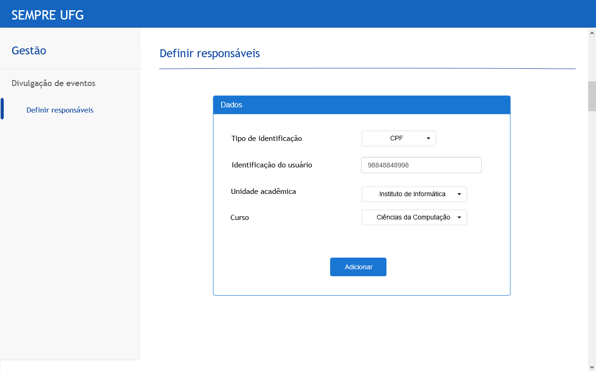
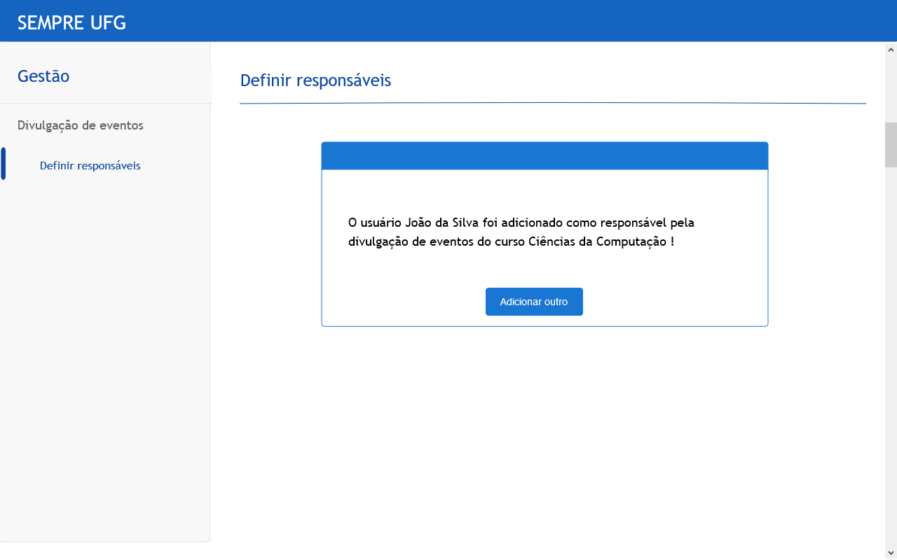
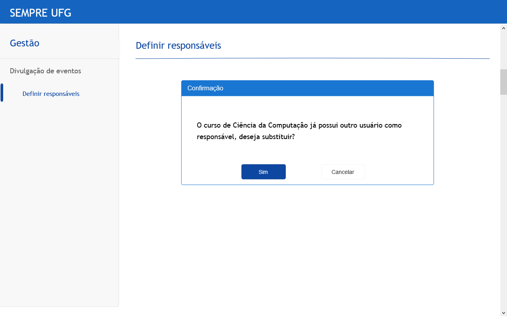

Storyboard RF-RespAprovDivulgEvent
=====================================================

## 1. RF-AtualEgres

### Pré-requisitos
- Fazer login
- Ter permissão de administrador
- Clicar na opção "Gestão"

### 1.1 Definir responsáveis

Ao entrar na sessão "Definir responsáveis" o usuário verá seus dados conforme a(s) tela(s) abaixo:  

O dropdown do campo **"Identificação"** possui as seguintes opções:

- CPF
- Passaporte

O dropdown do campo **"Unidade acadêmica"** e **"Curso"** devem possuir respectivamente as unidades e cursos do seguinte [link](https://www.ufg.br/n/68989-unidades-academicas-da-ufg)

Ao clicar no botão **"Adicionar"** o usuário poderá ser levado as seguintes tela:

##### Responsável definido com sucesso

##### Curso já possui outro responsável
Caso o curso já tenha outro responsável pela divulgação de eventos, é apresentada a mensagem de confirmação abaixo:

